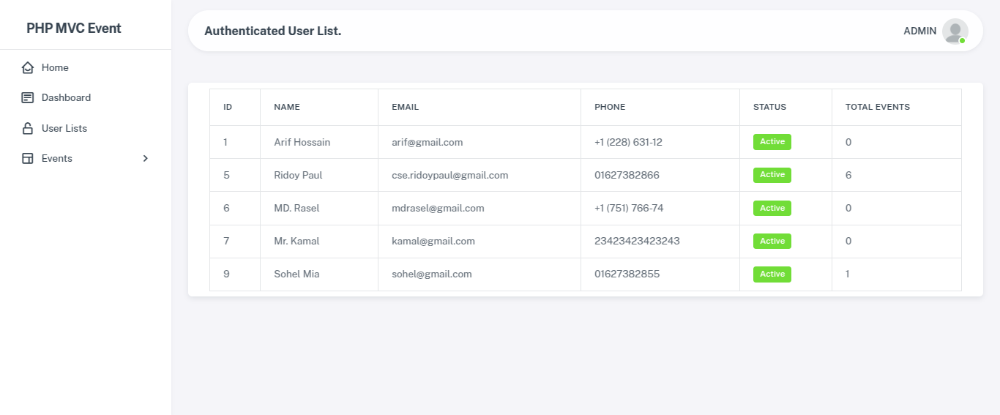

## PHP MVC Event Management System

<b>Project Overview:</b>

You can check the project into live server: https://event.hotelsbookingbd.com

Welcome to my project. In this event management project, I used PHP OOP with MVC (Model-View-Controller) design pattern. Here I used dynamic routing system, and Eloquent database mechanism for connect database table with model, and also for better Query. With all of these I also used a simple Bootstrap 5 template.


<b>Project Features:</b>
- <b>Home Page: </b> In Home page show all active events with pagination, Filter, Sortable & date time countdwon.
- <b>Authentication: </b> Registration, Login, Logout with ajax form submit.
- <b>Events: </b> Create, Edit, Delete (SoftDelete), View, Active Deactive features has been developed.
- <b>Attendee Registration: </b> A non authenticated user or an Authenticated user can Book / Register One Event once a time with same email & phone.
- <b>Event Dashboard: </b> At Event Dashboard show some event report with Attendee Registration table which is joined with events table.
- <b>Event Reports: </b> Only Admin can download specific event csv.
- <b>User List: </b> Only Admin can see User list with their Events Quantity.
- <b>Event Details: </b> In event details page users can see event all information and also can register from that page.

## Database ER Diagram
<p align="center">
  
</p>

## Project Setup

Clone this repository and follow these steps:

1) In you Xampp server inside the htdocs folder open terminal / git bash and run this code.

```sh
git clone https://github.com/Ridoy-paul/php-mvc-event-management-system.git
```

2) Then run cd php-mvc-event-management-system
```sh
cd php-mvc-event-management-system
```

3) Then Run composer update into your terminal / command line

```sh
composer update
```
4) Then make a database inside your phpMyadmin or HeidiSQL
5) Then import the <b>database.sql</b> file from project root folder.
6) Then update your database credentials inside the <b>Services folder > config.php</b> file.

```sh
define('DB_TYPE', 'mysql');
define('DB_HOST', '127.0.0.1');
define('DB_NAME', 'php_mvc_event_m_system');
define('DB_USER', 'root');
define('DB_PASS', '');
define('DB_PORT', '3306');
define('DB_CHARSET', 'utf8mb4');
```

7) Then run the following url into your browser

```sh
http://localhost/php-mvc-event-management-system/
```

Finally you will see the Home Page Like this ✨

<p align="center">
  
</p>


<b>Localhost Admin Login Info.</b>
- Admin Email: admin@gmail.com
- Admin Password: 12345678

<b>Localhost User Login Info.</b>
- User Email: cse.ridoypaul@gmail.com
- User Password: 12345678


## Live Server URL:
- You can check the project into live server: https://event.hotelsbookingbd.com

<b>Server Admin Login Info.</b>
- Admin Email: admin@gmail.com
- Admin Password: 12345678

<b>Server User Login Info.</b>
- User Email: cse.ridoypaul@gmail.com
- User Password: 12345678


## Screenshot of this project:
<b>Home Page: </b>
<p align="center">
  
</p>
<b>Auth Login Page: </b>
<p align="center">
  
</p>
<b>Auth Registration Page: </b>
<p align="center">
  
</p>
<b>Dashboard Page: </b>
<p align="center">
  
</p>
<b>Create Event Page: </b>
<p align="center">
  
</p>
<b>Edit Event Page: </b>
<p align="center">
  
</p>
<b>User Event List Page: </b>
<p align="center">
  
</p>
<b>Event Details Page: </b>
<p align="center">
  
</p>
<b>Event Registration Modal Popup: </b>
<p align="center">
  
</p>

## Admin Special Features Screenshot:
<b>Admin Event List Page with Download attendee list csv: </b>
<p align="center">
  
</p>

<b>Admin User List Page: </b>
<p align="center">
  
</p>

## That's all about my project, Thank you so much for giving your valuable time to see.


